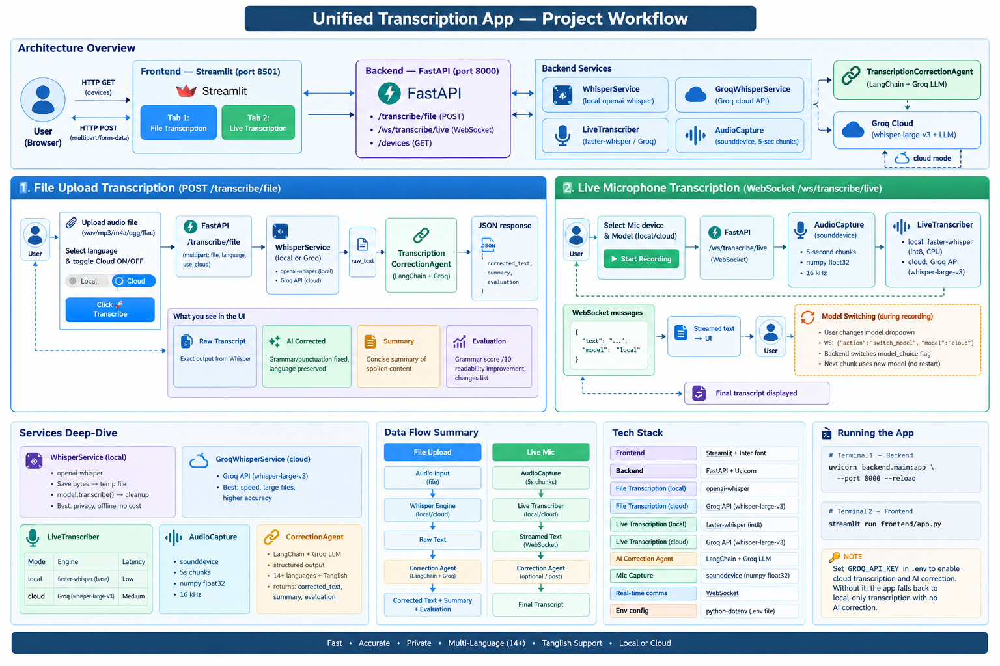

# 🎙️ Transcription App

A unified transcription service combining **file-based** and **live microphone** transcription in a single codebase.



## Architecture

```
Transcription-App/
├── backend/
│   ├── main.py                      # Single FastAPI app — both endpoints
│   ├── models/schemas.py            # Pydantic response models
│   ├── agents/transcription_agent.py # LangChain AI correction agent
│   └── services/
│       ├── whisper_service.py        # openai-whisper (file upload)
│       ├── groq_whisper_service.py   # Groq cloud whisper (file upload)
│       ├── live_transcriber.py       # faster-whisper (live mic)
│       └── audio_capture.py          # Sounddevice mic capture (live)
├── frontend/app.py                  # Streamlit UI (two tabs)
├── uploads/                         # Temp folder (auto-cleaned)
├── .env                             # API keys & config
└── requirements.txt
```

## Endpoints

| Method | Endpoint | Description |
|--------|----------|-------------|
| `GET`  | `/` | Health check |
| `GET`  | `/devices` | List available microphone input devices |
| `POST` | `/transcribe/file` | Upload audio file → transcript, AI correction, and quality/performance metrics |
| `WS`   | `/ws/transcribe/live` | Real-time live mic transcription with per-chunk latency metrics |

## Setup

```bash
# 1. Create virtual environment
python -m venv venv
venv\Scripts\activate   # Windows

# 2. Install dependencies
pip install -r requirements.txt

# 3. Configure API keys
# Edit .env and set your GROQ_API_KEY

# 4. Start the backend
uvicorn backend.main:app --port 8000 --reload

# 5. Start the frontend (new terminal)
streamlit run frontend/app.py
```

## Usage

- **File Transcription** → open `http://localhost:8501` → Tab 1 → upload a `.wav/.mp3/.m4a` file
- **Live Transcription** → Tab 2 → select microphone → click Start Recording
- **API Docs** → `http://localhost:8000/docs`

### Metrics

File transcription responses include audio duration, transcription latency, real-time
factor (RTF), word count, and words per minute. Add the optional **Reference text**
in the UI (or `reference_text` form field in the API) to also calculate word error
rate (WER) and character error rate (CER). Without a reference, WER and CER are
returned as `null` / shown as `N/A`.

Live transcription messages include a `metrics` object for each non-empty five-second
audio chunk; the UI shows the latest latency, running word count, and chunk total.

## Environment Variables

| Variable | Description | Default |
|----------|-------------|---------|
| `GROQ_API_KEY` | Groq API key for cloud transcription & AI agent | required |
| `WHISPER_MODEL` | Local whisper model size (`tiny`, `base`, `small`, `medium`) | `small` |
